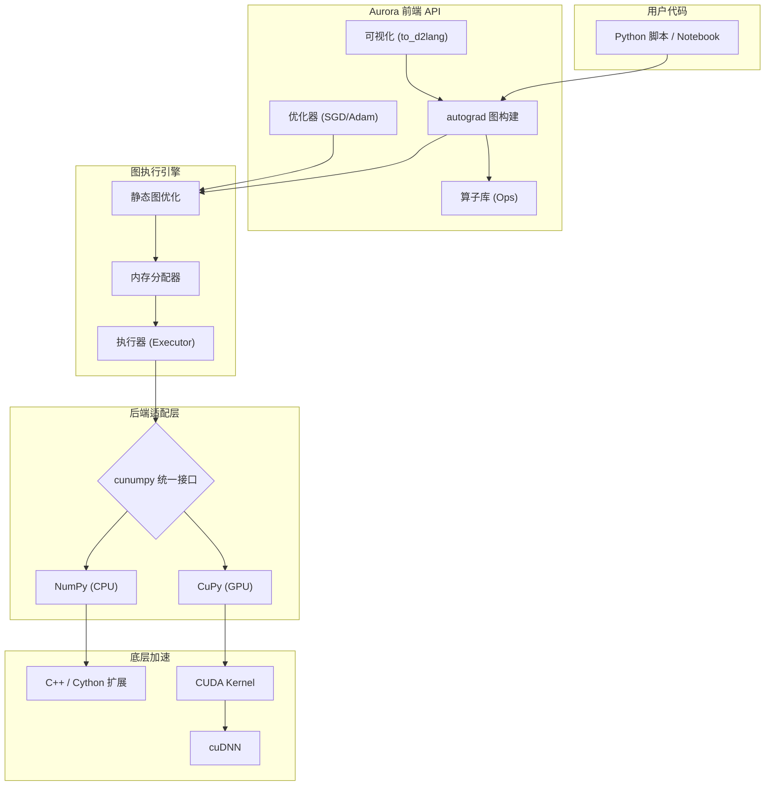
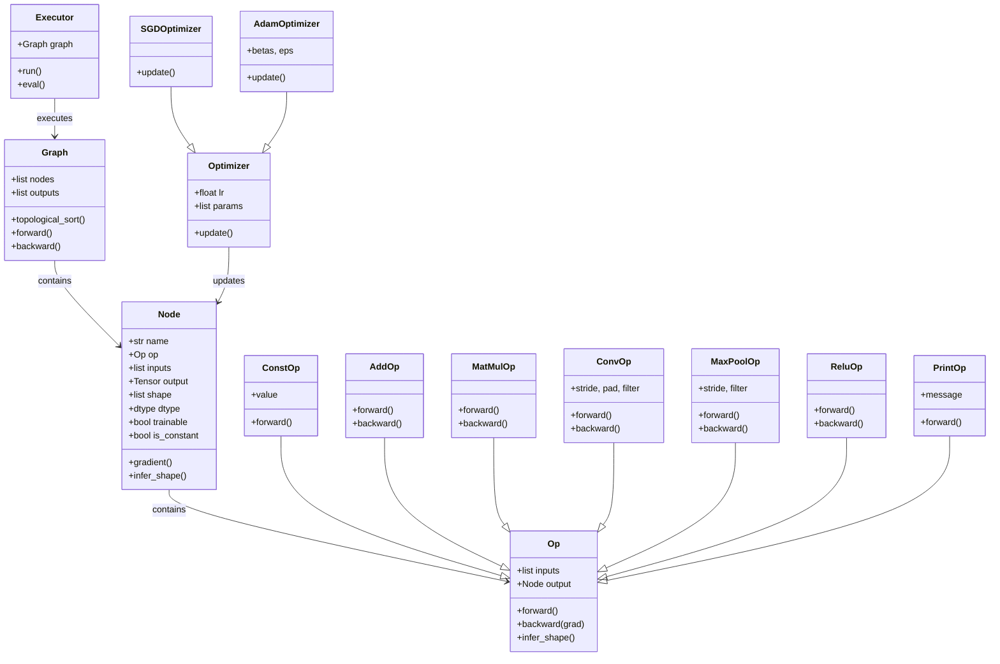
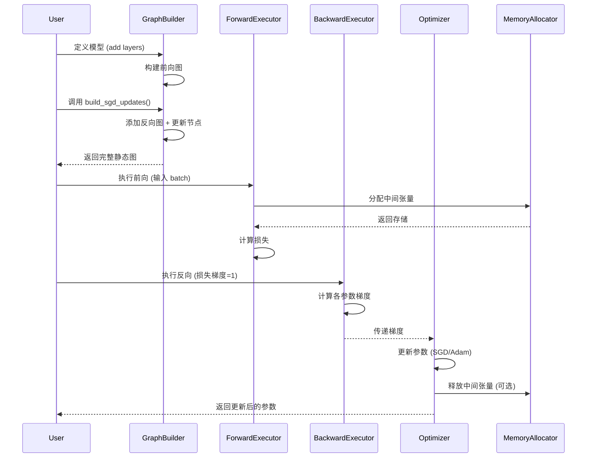

# 🚀 Aurora: 极简深度学习库

[](LICENSE)
[](https://www.python.org/downloads/)

**Aurora** 是一个极简的深度学习库，使用 Python、Cython 和 C++ 编写，借助 NumPy、CUDA 和 cuDNN 实现高效计算。尽管设计简洁，Aurora 仍然具备典型深度学习库中的先进设计理念：

- 🔧 **自动微分**：基于静态计算图。
- 📐 **形状和类型推断**：自动推导张量形状。
- 🧠 **静态内存分配**：训练和推理过程高效利用内存。

---

## 🎯 新增特性（本次扩展）

我们在原始 Aurora 基础上进行了以下增强：

- 🔁 **静态图优化器**：通过 `build_sgd_updates` / `build_adam_updates` 将优化器更新步骤纳入计算图，支持对优化过程本身进行自动微分和可视化。
- 📊 **D2 可视化工具**：使用 `to_d2lang` 将前向图、反向图及完整训练图导出为 [D2 语言](https://d2lang.com) 格式，清晰展示数据流和算子关系。
- 🔢 **常量节点（`ConstOp`）**：可创建常量节点，便于图结构清晰表达超参数。
- 🔢 **二元算子广播增强**：`AddOp`、`SubOp`、`MulOp`、`DivOp` 支持标量广播，简化图构建。
- 🐞 **调试节点（`PrintOp`）**：在计算图中插入打印节点，便于调试中间张量。

这些扩展使 Aurora 不仅是一个训练工具，更是一个**可解释、可调试、可优化**的深度学习框架。

---

## 🧱 整体架构



---

## 📐 核心类图（UML）



---

## 🔄 训练序列图（一次迭代）



---

## ✨ 核心设计思想

### 静态计算图

Aurora 采用“定义-运行”（Define-and-Run）模式，构建完整的静态图后再执行。这种设计便于优化和部署。

### 自动微分

通过 `ad.gradients` 自动构造反向传播图，支持高效梯度计算。

### 内存管理

静态图允许提前规划内存分配，减少动态分配开销。

### 为什么构建静态大图？

将前向、反向和优化器更新步骤融合为一张**完整的静态计算图**，能够带来显著的全局优化潜力：

- **全局内存分配**：整张图可在执行前预计算所有中间张量的生命周期，实现静态内存复用，大幅减少碎片化和动态分配开销。
- **算子融合**：编译器或运行时可以识别相邻的可融合操作（如 `Add` + `Relu`、`MatMul` + `Add`），合并为单一 kernel 以减少访存延迟。
- **复杂优化器支持**：对于未来出现的更先进优化器（如 [Muon](https://github.com/muon-org/muon)），静态图天然支持对更新过程本身进行自动微分，便于实现二阶优化、元学习等高级算法。

因此，静态大图不仅是可视化工具的基础，更是面向未来可扩展性的设计。

---

## 📊 静态图可视化示例

以下三张图分别展示了 MNIST 模型的前向计算图、包含反向传播梯度的图，以及带有 SGD 优化器更新的完整静态大图。所有图形均通过 `to_d2lang` 自动生成，可使用 D2 工具渲染。

### 前向计算图


### 反向传播图（含梯度节点）


### 完整训练图（含 SGD 优化器）


---

## 📈 训练验证：命令式 vs 静态图优化器

我们对比了原始命令式优化器（`au.optim.Adam`）与静态图优化器（`build_adam_updates`）的训练损失曲线。两者几乎完全重合，验证了静态图实现的正确性和数值一致性。


---

## 📦 安装

### 环境要求

- **必需**：
  - Python 3.6+
  - NumPy

- **可选（如需 GPU 加速）**：
  - NVIDIA GPU（支持 CUDA）
  - CUDA 工具包（推荐最新版）
  - cuDNN 库
  - Python 包：`cupy` 和 `cunumpy`（见下文安装说明）

> **说明**：Aurora 通过 `cunumpy` 提供统一的后端接口。如果不安装 `cupy`，则自动回退到 NumPy（CPU）后端。可通过环境变量 `ARRAY_BACKEND=numpy` 或 `ARRAY_BACKEND=cupy` 切换。

### 获取代码

```bash
git clone https://github.com/upul/Aurora.git
cd Aurora
```

### 构建 GPU 后端（可选）

如果希望使用 GPU 加速，请构建 CUDA 扩展：

```bash
cd cuda
make
cd ..
```

> **注意**：如果跳过此步骤，CPU 后端仍可正常工作。

### 安装 Python 依赖

```bash
pip install -r requirements.txt
```

**仅 CPU**（默认）：
```bash
pip install .
```

**GPU 支持**（安装 `cupy` 和 `cunumpy`）：
```bash
pip install cupy cunumpy   # 根据 CUDA 版本选择 cupy 安装方式，详见 cupy 官方文档
pip install .
```

> 若 `cupy` 安装失败，可参考 [CuPy 安装指南](https://docs.cupy.dev/en/stable/install.html) 选择适合你环境的预编译包或源码编译。

---

## 🧪 示例

### MNIST 训练（静态图优化器）

使用静态图版本的 MNIST 训练脚本：

```bash
python examples/mnist_static.py --optim sgd   # 使用 SGD
python examples/mnist_static.py --optim adam  # 使用 Adam
```

训练过程中会同时生成三张 D2 图：
- `mnist_forward.d2`：仅前向计算图。
- `mnist_backward.d2`：包含反向传播梯度节点。
- `mnist_full_sgd.d2` 或 `mnist_full_adam.d2`：完整图，包含优化器更新。

**查看 D2 图的方式：**

1. **在线查看（推荐）**：直接访问 [D2 Playground](https://play.d2lang.com/)，将生成的 `.d2` 文件内容粘贴到左侧编辑器中，右侧会实时渲染出可视化图表。
2. **本地渲染**：使用 D2 CLI 渲染为 SVG 或 PNG：

```bash
d2 mnist_full_adam.d2 graph.svg   # 生成 SVG
d2 mnist_full_adam.d2 graph.png   # 生成 PNG
```

### 原始 MNIST（命令式）

若需对比命令式训练，可运行：

```bash
python examples/mnist.py
```

### 切换后端

通过环境变量 `ARRAY_BACKEND` 可指定使用 NumPy 或 CuPy：

```bash
# 使用 CPU
export ARRAY_BACKEND=numpy
python examples/mnist_cnn.py

# 使用 GPU (需安装 cupy 和 cunumpy)
export ARRAY_BACKEND=cupy
python examples/mnist_cnn.py
```

更多示例请参考 [`examples/`](https://github.com/upul/Aurora/tree/master/examples) 目录。

---

## 🤝 致谢

本项目起源于 [CSE 599G1: Deep Learning System Design](http://dlsys.cs.washington.edu/) 课程。感谢课程讲师和助教们的悉心指导，为 Aurora 打下了坚实基础。

---

## 📚 参考文献

1. [CSE 599G1: Deep Learning System Design](http://dlsys.cs.washington.edu/)
2. [MXNet Architecture](https://mxnet.incubator.apache.org/architecture/index.html)
3. [Parallel Programming With CUDA | Udacity](https://www.udacity.com/course/intro-to-parallel-programming--cs344)
4. [Programming Massively Parallel Processors, Third Edition](https://www.amazon.com/Programming-Massively-Parallel-Processors-Hands/dp/0128119861/)

---

## 📄 许可证

Apache License 2.0

---

## 📌 未来计划

- Dropout 和 Batch Normalization。
- 高级 API（类似 Keras）。
- 预训练模型加载。
- 模型检查点。

---

> **性能示例**：在 MNIST CNN 上使用 `cupy` 后端，训练 400 次迭代耗时约 62 秒，验证准确率 98.24%。